# 🏗️ Arquitectura Técnica — Travesia AI Journeys

> **Última actualización**: Febrero 2026

---

## 📑 Tabla de Contenidos

1. [Visión General](#visión-general)
2. [Stack Tecnológico](#stack-tecnológico)
3. [Diagrama de Arquitectura](#diagrama-de-arquitectura)
4. [Estructura del Proyecto](#estructura-del-proyecto)
5. [Frontend](#frontend)
6. [Backend (Edge Functions)](#backend-edge-functions)
7. [Base de Datos](#base-de-datos)
8. [Pipeline de Generación de Itinerarios](#pipeline-de-generación-de-itinerarios)
9. [Autenticación y Autorización](#autenticación-y-autorización)
10. [Integraciones Externas](#integraciones-externas)
11. [Sistema de Chat](#sistema-de-chat)
12. [Gestión de Estado](#gestión-de-estado)
13. [Internacionalización (i18n)](#internacionalización-i18n)
14. [Seguridad](#seguridad)
15. [Variables de Entorno](#variables-de-entorno)

---

## Visión General

**Travesia AI Journeys** es una plataforma SPA (Single Page Application) que combina un chat conversacional con IA y un panel interactivo de itinerarios para planificar viajes personalizados. 

La arquitectura sigue un patrón **cliente-pesado con backend serverless**, donde el frontend React se comunica con Edge Functions de Supabase que orquestan llamadas a APIs de IA y datos de viajes.

### Arquitectura de Alto Nivel

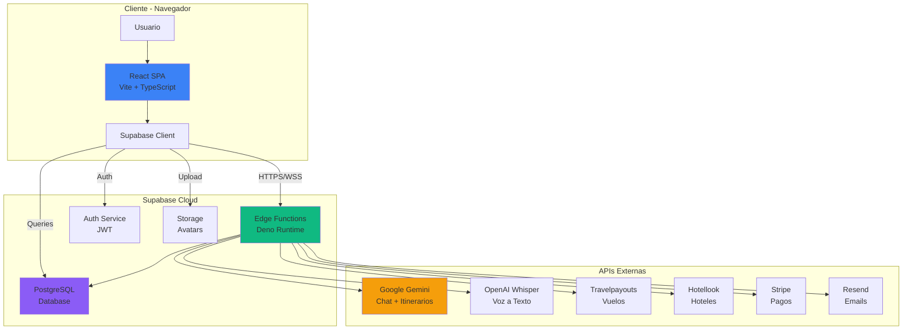

---

## Stack Tecnológico

### Frontend

| Capa | Tecnología | Versión | Propósito |
|------|-----------|---------|-----------|
| **Build Tool** | Vite | 5.x | HMR, bundling, dev server |
| **Framework** | React | 18.x | UI y lógica de aplicación |
| **Lenguaje** | TypeScript | 5.x | Tipado estático |
| **Styling** | Tailwind CSS | 3.x | Utility-first CSS |
| **Componentes UI** | shadcn/ui + Radix | | Sistema de diseño |
| **Routing** | React Router | 6.x | Navegación SPA |
| **Data Fetching** | TanStack Query | 5.x | Cache, refetch, estados |
| **Maps** | Leaflet + React Leaflet | | Mapas interactivos |
| **Forms** | React Hook Form + Zod | | Formularios y validación |
| **State** | React Context | | Estado global |

### Backend & Servicios

| Servicio | Tecnología | Propósito |
|----------|-----------|-----------|
| **BaaS** | Supabase | Auth, DB, Edge Functions, Storage |
| **Runtime** | Deno | Edge Functions runtime |
| **Database** | PostgreSQL | Base de datos relacional |
| **IA Chat** | Google Gemini 2.0 Flash | Conversación y generación |
| **IA Voz** | OpenAI Whisper | Transcripción de audio |
| **Vuelos** | Travelpayouts API | Precios reales de vuelos |
| **Hoteles** | Hotellook API | Búsqueda de alojamiento |
| **Pagos** | Stripe Checkout | Procesamiento de pagos |
| **Emails** | Resend | Emails transaccionales |

---

## Diagrama de Arquitectura

### Flujo de Datos Completo

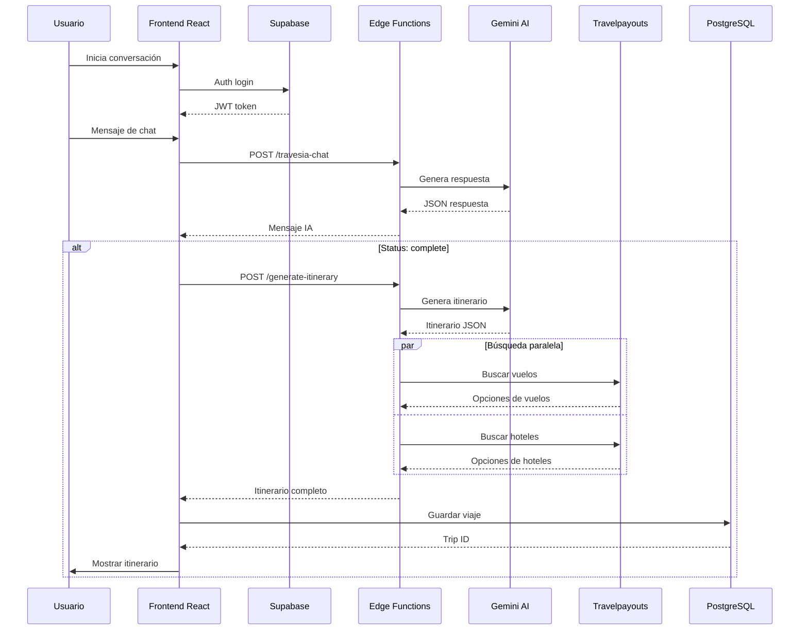

---

## Estructura del Proyecto

```
travesia-ai-journeys/
├── public/
│   ├── favicon.ico
│   ├── logo-email.svg
│   └── robots.txt
│
├── src/
│   ├── assets/                    # Assets importados vía ES6
│   │   ├── activities/            # Imágenes por tipo
│   │   ├── destinations/          # Fotos de ciudades
│   │   ├── icons/                 # Iconos SVG
│   │   └── hero-background.jpg
│   │
│   ├── components/
│   │   ├── ui/                    # shadcn/ui (40+ componentes)
│   │   ├── itinerary/             # Sistema modular de itinerario
│   │   │   ├── types.ts           # Tipos compartidos
│   │   │   ├── ItineraryHeader.tsx
│   │   │   ├── TabItinerario.tsx
│   │   │   ├── TabTransporte.tsx
│   │   │   ├── TabAlojamiento.tsx
│   │   │   ├── TabActividades.tsx
│   │   │   └── TabInfoLocal.tsx
│   │   ├── ChatBubble.tsx
│   │   ├── ItineraryPanel.tsx
│   │   ├── Navbar.tsx
│   │   └── ...
│   │
│   ├── contexts/                  # Contextos globales
│   │   ├── CurrencyContext.tsx
│   │   ├── LanguageContext.tsx
│   │   └── LocationContext.tsx
│   │
│   ├── hooks/                     # Custom hooks
│   │   ├── useAuth.tsx
│   │   ├── useVoiceRecorder.ts
│   │   └── use-mobile.tsx
│   │
│   ├── integrations/supabase/     # Auto-generado
│   │   ├── client.ts
│   │   └── types.ts
│   │
│   ├── lib/                       # Utilidades
│   │   ├── api/
│   │   │   └── travelSearch.ts
│   │   ├── destinationImages.ts
│   │   ├── itineraryHtml.ts
│   │   ├── translations.ts
│   │   └── utils.ts
│   │
│   ├── pages/                     # Vistas/Páginas
│   │   ├── LandingPage.tsx
│   │   ├── ChatPage.tsx          # ~1700 líneas
│   │   ├── TripDetail.tsx
│   │   ├── Profile.tsx
│   │   ├── AdminPanel.tsx
│   │   └── ...
│   │
│   ├── App.tsx
│   ├── main.tsx
│   └── index.css
│
├── supabase/
│   ├── config.toml
│   ├── migrations/                # SQL migrations
│   └── functions/                 # Edge Functions (Deno)
│       ├── travesia-chat/
│       ├── generate-itinerary/
│       ├── search-flights/
│       ├── search-hotels/
│       ├── voice-to-text/
│       ├── send-password-reset/
│       ├── verify-reset-token/
│       └── create-payment/
│
├── ARCHITECTURE.md
├── README.md
└── package.json
```

---

## Frontend

### Routing y Páginas

```mermaid
graph LR
    A[/] --> B[LandingPage]
    C[/auth] --> D[Auth Login]
    E[/register] --> F[Register]
    G[/chat] --> H[ChatPage]
    I[/mis-viajes] --> J[MyTrips]
    K[/viaje/:id] --> L[TripDetail]
    M[/perfil] --> N[Profile]
    O[/admin] --> P[AdminPanel]
    
    style H fill:#3b82f6
    style L fill:#3b82f6
    style P fill:#ef4444
```

| Ruta | Componente | Acceso | Descripción |
|------|-----------|--------|-------------|
| `/` | LandingPage | Público | Página principal  |
| `/auth` | Auth | Público | Login |
| `/register` | Register | Público | Registro |
| `/chat` | ChatPage | Público* | Chat + Itinerario |
| `/mis-viajes` | MyTrips | Auth | Lista de viajes |
| `/viaje/:id` | TripDetail | Auth | Detalle de viaje |
| `/perfil` | Profile | Auth | Perfil de usuario |
| `/admin` | AdminPanel | Admin | Panel administrativo |

> *Acceso anónimo limitado

### Contextos Globales

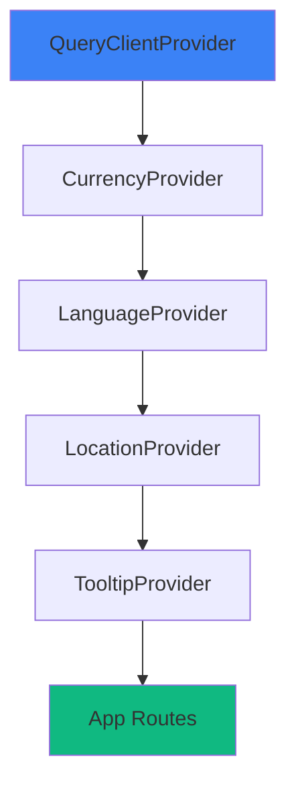

#### CurrencyContext
- Detecta moneda según ubicación
- Almacena en `localStorage`
- Provee: `currency`, `setCurrency`, `convert()`

#### LanguageContext
- Idiomas: ES, EN, DE, PT, IT
- Persistencia en `localStorage`
- Se pasa a Edge Functions

#### LocationContext
- Geolocalización del navegador
- Provee: `city`, `country`, `coordinates`
- Usado para sugerir origen

### Componentes Principales

#### ChatPage

El componente más complejo (~1756 líneas):

**Responsabilidades**:
- Layout dual: Chat (40%) + Itinerario (60%)
- Gestión de conversaciones
- Comunicación con Edge Functions
- Generación automática de itinerarios
- Persistencia en Supabase
- Cache local
- Modo anónimo
- Integración de voz

**Flujo de Generación**:

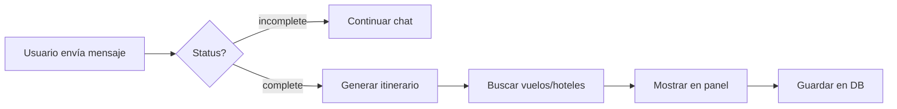

#### ItineraryPanel

Panel orquestador con 5 tabs:

1. **Itinerario** - Día a día
2. **Transporte** - Vuelos, coches, local
3. **Alojamiento** - Hoteles
4. **Actividades** - Sugerencias
5. **Info Local** - Clima, cultura, consejos

---

## Backend (Edge Functions)

Todas las Edge Functions corren en **Deno** runtime. Configuración en `supabase/config.toml`:

```toml
[functions.travesia-chat]
verify_jwt = false

[functions.generate-itinerary]
verify_jwt = false
```

### Diagrama de Edge Functions

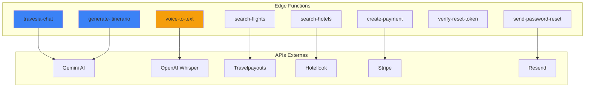

### 1. travesia-chat

**Propósito**: Chat conversacional para recopilar datos del viaje

| Campo | Detalle |
|-------|---------|
| **Endpoint** | `POST /functions/v1/travesia-chat` |
| **API** | Google Gemini 2.0 Flash |
| **Secret** | `GOOGLE_AI_API_KEY` |
| **Auth** | No requerida |

**Flujo**:

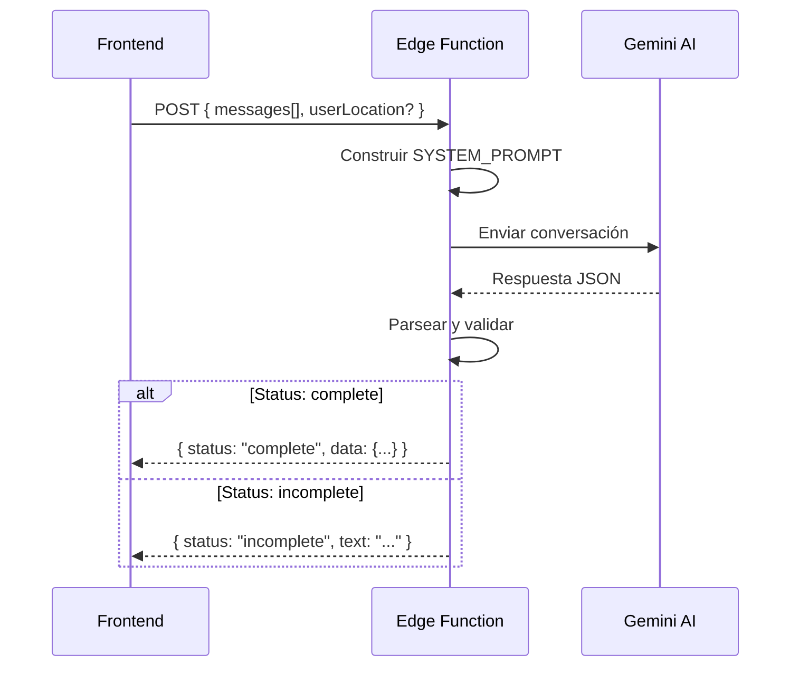

**Datos recopilados**:
- Destino + código IATA
- Origen + código IATA
- Fechas (salida/regreso)
- Pasajeros
- Presupuesto
- Estilo de viaje
- Idioma

### 2. generate-itinerary

**Propósito**: Generar itinerario completo en JSON estructurado

| Campo | Detalle |
|-------|---------|
| **Endpoint** | `POST /functions/v1/generate-itinerary` |
| **API** | Google Gemini 2.0 Flash |
| **Validación** | Zod schema |

**Input validado**:
```typescript
{
  description: string,
  origin: string,
  destination: string,
  startDate: "2026-MM-DD",
  endDate: "2026-MM-DD",
  travelers: number,      // 1-20
  budget?: number,
  flightData?: any,
  language?: string       // Default: "es"
}
```

**Output**: Estructura `ItineraryData`:
- `resumen` - Título, descripción, highlights
- `transporte` - Vuelos, coches, local
- `alojamiento` - Hoteles (2-3 opciones)
- `actividades` - Sugerencias
- `itinerario` - Día a día
- `comentarios` - Consejos, advertencias
- `infoLocal` - Clima, cultura, seguridad

### 3. search-flights

**Propósito**: Buscar vuelos reales

| Campo | Detalle |
|-------|---------|
| **Endpoint** | `POST /functions/v1/search-flights` |
| **API** | Travelpayouts Aviasales |
| **Secret** | `TRAVELPAYOUTS_API_TOKEN` |

**Input/Output**:
```typescript
// Input
{
  origin: string,        // IATA o nombre
  destination: string,
  startDate: "YYYY-MM-DD",
  endDate?: "YYYY-MM-DD",
  passengers: number
}

// Output
{
  flights: FlightOption[],
  isEstimated: boolean
}
```

### 4. search-hotels

**Propósito**: Buscar hoteles con precios reales

| Campo | Detalle |
|-------|---------|
| **Endpoint** | `POST /functions/v1/search-hotels` |
| **API** | Hotellook (Travelpayouts) |

**Flujo en 2 pasos**:
1. Lookup de ciudad por IATA/nombre
2. Búsqueda de hoteles en la ciudad

### 5. voice-to-text

**Propósito**: Transcribir audio a texto

| Campo | Detalle |
|-------|---------|
| **Endpoint** | `POST /functions/v1/voice-to-text` |
| **API** | OpenAI Whisper |
| **Auth** | **Requerida** (Bearer) |

**Flujo**:
1. Recibe audio en base64 (WebM)
2. Procesa en chunks
3. Envía a Whisper
4. Retorna texto transcrito

### 6-8. Funciones Auxiliares

| Función | Propósito | API |
|---------|-----------|-----|
| send-password-reset | Email de reset | Resend |
| verify-reset-token | Verificar token | Supabase |
| create-payment | Checkout Stripe | Stripe |

---

## Base de Datos

### Esquema Entidad-Relación

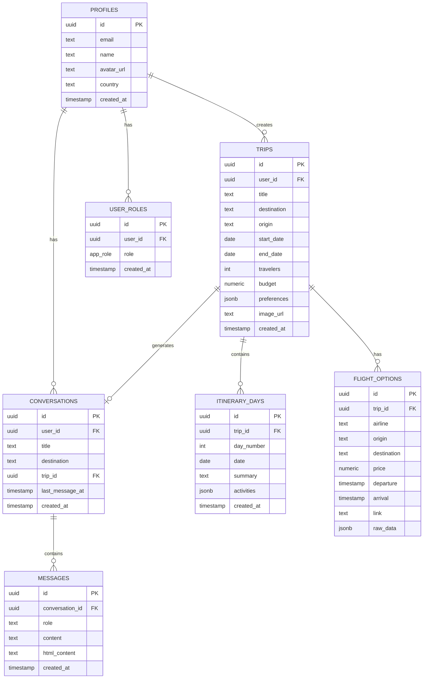

### Tablas Principales

#### profiles
```sql
CREATE TABLE profiles (
  id UUID PRIMARY KEY REFERENCES auth.users,
  email TEXT NOT NULL,
  name TEXT,
  avatar_url TEXT,
  country TEXT,
  created_at TIMESTAMP DEFAULT NOW()
);
```

#### trips
```sql
CREATE TABLE trips (
  id UUID PRIMARY KEY DEFAULT gen_random_uuid(),
  user_id UUID REFERENCES profiles(id) ON DELETE CASCADE,
  title TEXT NOT NULL,
  destination TEXT,
  origin TEXT,
  start_date DATE,
  end_date DATE,
  travelers INTEGER,
  budget NUMERIC,
  preferences JSONB,
  image_url TEXT,
  created_at TIMESTAMP DEFAULT NOW()
);
```

#### conversations
```sql
CREATE TABLE conversations (
  id UUID PRIMARY KEY DEFAULT gen_random_uuid(),
  user_id UUID REFERENCES profiles(id) ON DELETE CASCADE,
  title TEXT,
  destination TEXT,
  trip_id UUID REFERENCES trips(id),
  last_message_at TIMESTAMP,
  created_at TIMESTAMP DEFAULT NOW()
);
```

### Row Level Security (RLS)

Todas las tablas tienen políticas RLS:

```sql
-- Usuarios solo ven sus propios viajes
CREATE POLICY "Users can view own trips"
ON trips FOR SELECT
USING (auth.uid() = user_id);

-- Admins ven todo
CREATE POLICY "Admins can view all trips"
ON trips FOR SELECT
USING (
  EXISTS (
    SELECT 1 FROM user_roles
    WHERE user_id = auth.uid() AND role = 'admin'
  )
);
```

### Funciones y Triggers

#### handle_new_user()
Trigger en `auth.users` que crea automáticamente el perfil:

```sql
CREATE FUNCTION handle_new_user()
RETURNS TRIGGER AS $$
BEGIN
  INSERT INTO public.profiles (id, email, name, avatar_url)
  VALUES (
    NEW.id,
    NEW.email,
    COALESCE(NEW.raw_user_meta_data->>'name', NEW.raw_user_meta_data->>'full_name'),
    NEW.raw_user_meta_data->>'avatar_url'
  );
  RETURN NEW;
END;
$$ LANGUAGE plpgsql SECURITY DEFINER;
```

---

## Pipeline de Generación de Itinerarios

### Flujo Completo

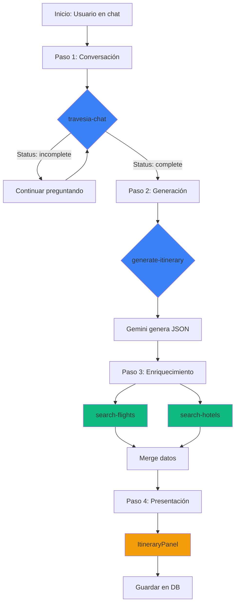

### Manejo de Modificaciones

Cuando un usuario pide cambios:

1. Frontend envía `hasItinerary: true` + `existingTripData`
2. Chat retorna `status: "complete"` con datos actualizados
3. Se regenera el itinerario completo
4. Datos existentes = fallback

---

## Autenticación y Autorización

### Métodos de Autenticación

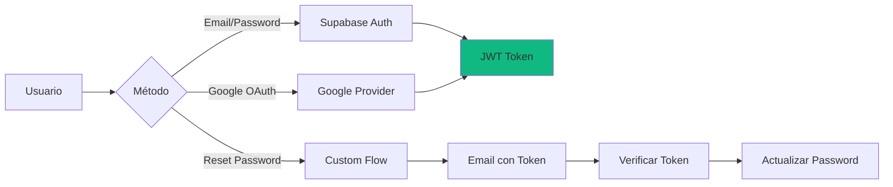

### Hook useAuth

```typescript
const {
  user,              // User | null
  session,           // Session | null
  loading,           // boolean
  signInWithGoogle,  // () => Promise
  signInWithEmail,   // (email, password) => Promise
  signUpWithEmail,   // (email, password) => Promise
  signOut,           // () => Promise
  resetPassword,     // (email) => Promise
} = useAuth();
```

### Flujo de Reset de Contraseña

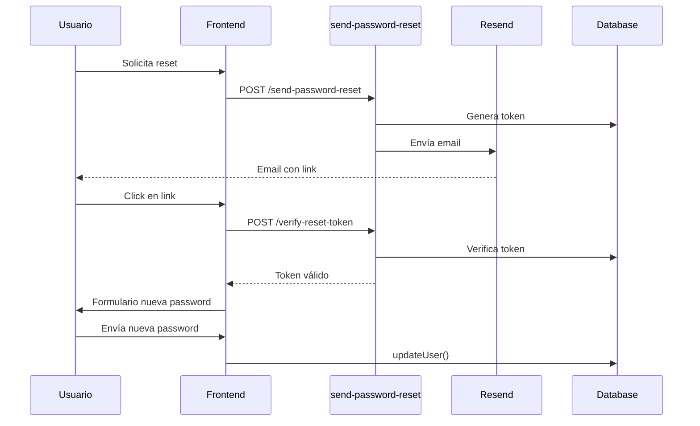

---

## Integraciones Externas

| Servicio | Uso | Config | Documentación |
|----------|-----|--------|---------------|
| Google Gemini | Chat + Itinerarios | `GOOGLE_AI_API_KEY` | [Docs](https://ai.google.dev) |
| OpenAI Whisper | Transcripción | `OPENAI_API_KEY` | [Docs](https://platform.openai.com) |
| Travelpayouts | Vuelos | `TRAVELPAYOUTS_API_TOKEN` | [Docs](https://support.travelpayouts.com) |
| Hotellook | Hoteles | `TRAVELPAYOUTS_API_TOKEN` | [Docs](https://hotellook.com/api) |
| Stripe | Pagos | `STRIPE_SECRET_KEY` | [Docs](https://stripe.com/docs) |
| Resend | Emails | `RESEND_API_KEY` | [Docs](https://resend.com/docs) |
| Nominatim | Geocoding | Public | [Docs](https://nominatim.org) |

---

## Sistema de Chat

### Arquitectura del Chat

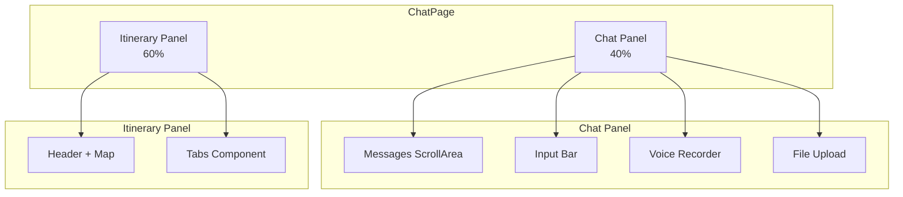

### Persistencia de Conversaciones

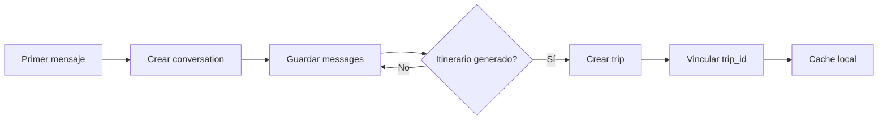

### Modo Anónimo

- Uso limitado sin cuenta
- Draft en `sessionStorage`
- Banner de registro después de X mensajes
- Restauración de draft al registrarse

---

## Gestión de Estado

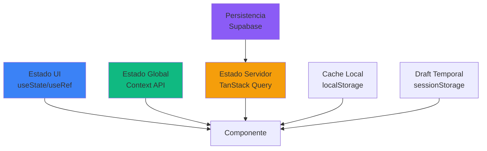

| Tipo | Tecnología | Ámbito |
|------|-----------|--------|
| Estado UI | useState/useRef | Local |
| Estado global | React Context | App-wide |
| Estado servidor | TanStack Query | Cache con invalidación |
| Persistencia | Supabase | Database |
| Cache local | localStorage | Preferencias |
| Draft temporal | sessionStorage | Drafts anónimos |

### Tipos Principales

```typescript
// Centralizado en src/components/itinerary/types.ts
ItineraryData
├── resumen
├── transporte
│   ├── vuelos[]
│   ├── transporteLocal
│   └── opcionesCoche[]
├── alojamiento
│   └── opciones[]
├── actividades[]
├── itinerario[]
│   └── actividades[]
├── comentarios
└── infoLocal
```

---

## Internacionalización (i18n)

### Idiomas Soportados

| Código | Idioma | Progress |
|--------|--------|----------|
| ES | Español | 100% |
| EN | English | 100% |
| DE | Deutsch | 100% |
| PT | Português | 100% |
| IT | Italiano | 100% |

### Implementación

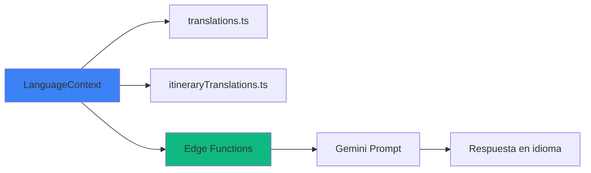

- **Frontend**: `translations.ts` + `itineraryTranslations.ts`
- **Backend Chat**: Auto-detección del idioma
- **Backend Itinerario**: Parámetro `language`
- **APIs**: `lang` parameter donde aplicable

---

## Seguridad

### Capas de Seguridad

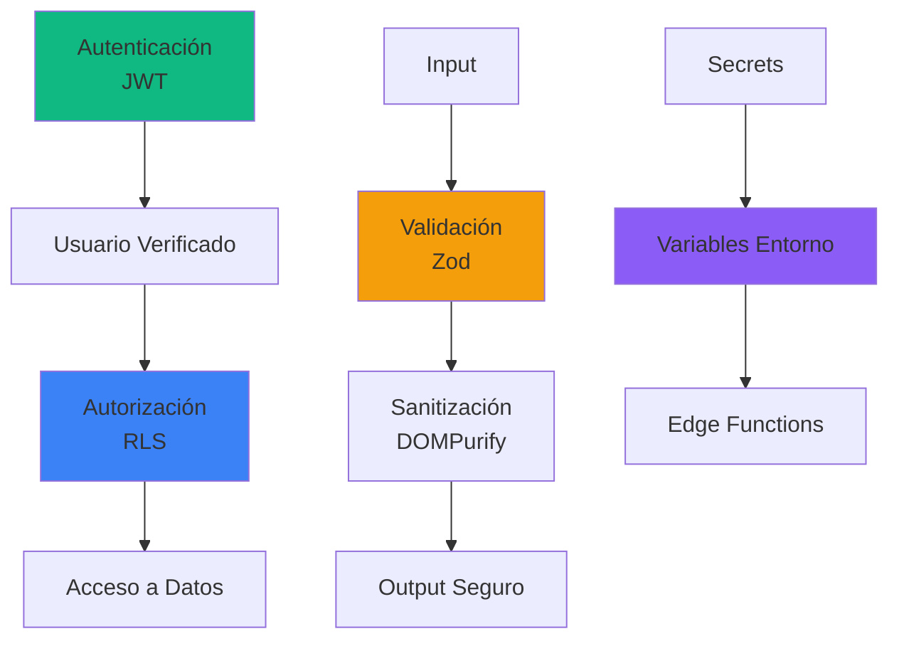

| Capa | Implementación |
|------|---------------|
| **Autenticación** | Supabase Auth (JWT) |
| **Autorización** | Row Level Security (RLS) |
| **Sanitización** | DOMPurify |
| **Validación** | Zod schemas |
| **Secrets** | Variables de entorno |
| **CORS** | Configurado en Edge Functions |
| **Rate Limiting** | Manejo de 429 |

---

## Variables de Entorno

### Frontend (Públicas)

```env
VITE_SUPABASE_URL=https://xxxxx.supabase.co
VITE_SUPABASE_PUBLISHABLE_KEY=eyJhbGciOiJIUzI1NiIsInR5cC...
VITE_SUPABASE_PROJECT_ID=xxxxx
```

### Backend (Secrets)

```env
# IA
GOOGLE_AI_API_KEY=AIzaSyxxxxxx
OPENAI_API_KEY=sk-proj-xxxxx

# Viajes
TRAVELPAYOUTS_API_TOKEN=xxxxx

# Pagos & Emails
STRIPE_SECRET_KEY=sk_live_xxxxx
RESEND_API_KEY=re_xxxxx

# Supabase
SUPABASE_SERVICE_ROLE_KEY=eyJhbGciOiJIUzI1NiIsInR5cC...
SUPABASE_URL=https://xxxxx.supabase.co
SUPABASE_ANON_KEY=eyJhbGciOiJIUzI1NiIsInR5cC...
```

---

## Recursos Adicionales

- [React Documentation](https://react.dev)
- [Supabase Docs](https://supabase.com/docs)
- [Google AI Documentation](https://ai.google.dev)
- [TanStack Query](https://tanstack.com/query)
- [shadcn/ui](https://ui.shadcn.com)

---

**¿Preguntas? Consulta el [Admin Playbook](./ADMIN_PLAYBOOK.md) o [Troubleshooting](./TROUBLESHOOTING.md)**

*Documento actualizado - Febrero 2026*

